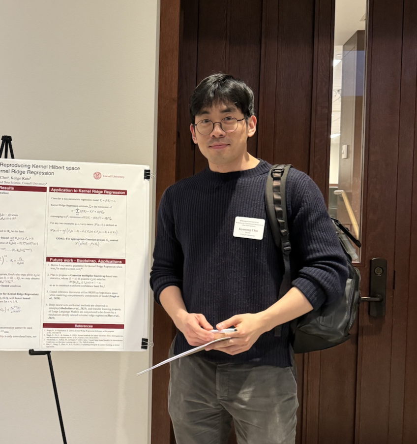

<html lang="en">
<head>
    <meta charset="UTF-8">
    <meta name="viewport" content="width=device-width, initial-scale=1.0">
    <meta name="google-site-verification" content="Wby9p_eTBuhZCnwZryTc8LsCvXkjgZVVj4wgx9D_e90" />
    <title>Kyuseong Choi</title>
    
</head>
<body>
    

        

            
            
Kyuseong Choi

            
Statistics PhD Candidate

            
📍 Cornell Tech

            
            

                <a href="mailto:kc728@cornell.edu">📧 Email</a>
                <a href="https://scholar.google.com/citations?user=YIlTXCIAAAAJ&hl=en&oi=ao">🎓 Google Scholar</a>
                <a href="https://www.linkedin.com/in/kyuseong-choi-ab532a1b4/">💼 LinkedIn</a>
                <a href="cv.pdf">📄 CV</a>
            

        

        

            <nav class="nav">
                <a href="#about" class="active">About</a>
                <a href="#research">Research</a>
                <a href="#publications">Publications</a>
                <a href="cv.pdf">CV</a>
            </nav>

            <section id="about">
                <h1>Welcome!</h1>
                
                

                    Currently, I am a Statistics PhD student at Cornell Tech. My current research interests include efficient and interpretable policy optimization, personalization in causal inference (via foundational models) and central limit theorems for high-dimensional data points. I am co-advised by <a href="https://raazdwivedi.github.io">Raaz Dwivedi</a> and <a href="https://sites.google.com/site/kkatostat/home/research?authuser=0">Kengo Kato</a>.
                

            </section>

            

                <h2>Education</h2>
                

                    
Statistics, PhD, Cornell Tech (2021 - Present)

                

                

                    
Biostatistics, MS, University of Michigan, Ann Arbor (2021)

                

                

                    
BBA Business Administration, Korea University (2019)

                

            

            

                <h2>Working Papers</h2>
                

                    
GRPO++: Improved policy optimization using ranked rewards

                    
Kyuseong Choi, Dwaipayan Saha, Woojeong Kim, Anish Agarwal, Raaz Dwivedi

                

                

                    
Gaussian approximation in Reproducing kernel Hilbert space, applications to kernel ridge regression

                    
Kyuseong Choi, Kengo Kato

                

            

            

                <h2>Preprints</h2>
                

                    

                        <a href="https://arxiv.org/abs/2510.17648v1">Wild regenerative block bootstrap for Harris recurrent Markov chains</a>
                    

                    
Kyuseong Choi, Gabriella Ciolek

                

                

                    

                        <a href="https://arxiv.org/abs/2510.02625">TabImpute: Accurate and Fast Zero-Shot Missing-Data Imputation with a Pre-Trained Transformer</a>
                    

                    
Jacob Feitelberg, Dwaipayan Saha, Kyuseong Choi, Zaid, Ahmad, Anish Agarwal, Raaz Dwivedi

                

                

                    

                        <a href="https://arxiv.org/abs/2410.13381">Learning counterfactual distribution via kernel nearest neighbors</a>
                    

                    
Kyuseong Choi, Jacob Feitelberg, Anish Agarwal, Raaz Dwivedi

                

                

                    

                        <a href="https://arxiv.org/abs/2410.13112">Distributional matrix completion via nearest neighbors in the Wasserstein space</a>
                    

                    
Jacob Feitelberg, Kyuseong Choi, Anish Agarwal, Raaz Dwivedi

                

                

                    

                        <a href="https://arxiv.org/abs/2506.04166">N2: A Unified Python Package and Test Bench for Nearest Neighbor-Based Matrix Completion</a>
                    

                    
Caleb Chin, Aashish Khubchandani, Harshvardhan Maskara, Kyuseong Choi, Jacob Feitelberg, Albert Gong, Manit Paul, Tathagata Sadhukhan, Anish Agarwal, Raaz Dwivedi

                

            

            

                <h2>Publications</h2>
                

                    

                        <a href="https://arxiv.org/abs/2410.13749">Supervised kernel thinning</a>
                    

                    
Albert Gong, Kyuseong Choi, Raaz Dwivedi

                    
NeurIPS 2024

                

                

                    

                        <a href="https://academic.oup.com/biometrics/article/80/1/ujad005/7609159">Robust data integration from multiple external sources for generalized linear models with binary outcomes</a>
                    

                    
Kyuseong Choi, Jeremy M.G. Taylor, Peisong Han

                    
Biometrics, Volume 80, Issue 1, March 2024

                

                

                    

                        <a href="https://academic.oup.com/biomet/article-abstract/110/1/119/6567343">Data integration: exploiting ratios of parameter estimates from a reduced external model</a>
                    

                    
Jeremy M.G. Taylor, Kyuseong Choi, Peisong Han

                    
Biometrika, Volume 110, Issue 1, March 2023, Pages 119-134

                

            

        

    

</body>
</html>
